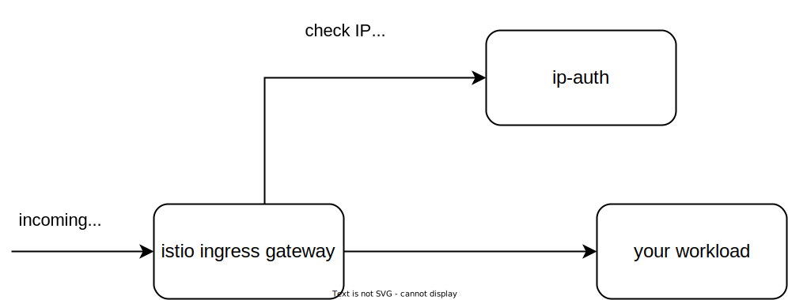

# IP-auth

## Overview
<!--- mandatory section --->

IP-auth is an external authorizer for Istio Ingress Gateway. It is a simple service that checks if the request's IP address is not in a list of blocked IP ranges. If the IP address is not in the list, the service returns a 200 OK response. If the IP address is in the list, the service returns a 403 Forbidden response.



The list of blocked IP ranges can be stored in a file. The service reads the file on startup. There is also possibility to fetch the list from a remote server by providing the config file with the connection details. 


## Prerequisites

- kubectl
- kubernetes cluster with Kyma istio module installed

## Installation

Enable ip-auth in the istio module by adding the following configuration to the `istio` CR:

```yaml
spec:
  config:
    authorizers:
    - name: ip-auth
      port: 8000
      service: ip-auth.ip-auth.svc.cluster.local
      headers:
        inCheck:
          include:
          - x-envoy-external-address
          - x-forwarded-for      
```

You can edit the `istio` CR by running the following command:
```bash
kubectl edit istio -n kyma-system default
```

To install ip-auth apply [ip-auth.yaml](ip-auth.yaml) manifest in your cluster:
```bash
kubectl apply -f https://raw.githubusercontent.com/kyma-project/ip-auth/main/ip-auth.yaml
```
It creates ip-auth namespace with deployment and service. It also creates AuthorizationPolicy that enables custom authorizer for all requests coming to istio ingress gateway.

The ip-auth deployment mounts the config file from secret called config. The config you can create from the file by running the following command:
```bash
kubectl -n ip-auth create secret generic config --from-file=config.yaml 
```
The content of the config file should look like this:
```yaml
clientId: here-goes-your-client-id
clientSecret: here-goes-your-client-secret
tokenUrl: https://example.com/oauth2/token
policyUrl: https://example.com/policy
policyUpdateInterval: 300
```

If you want to use a static list of blocked IP ranges, you can create the config file with the list of blocked IP ranges and create the config map from it. The content of the `policy.json` file should look like this:
```json
[
  {
    "network": "1.2.3.0/24",
    "policy": "BLOCK_ACCESS"
  },
  {
    "network": "2.4.0.0/16",
    "policy": "BLOCK_ACCESS"
  },
  {
    "network": "5.6.7.128/25",
    "policy": "BLOCK_ACCESS"
  },
]
```

You can create the config map from the file by running the following command:
```bash
kubectl -n ip-auth create configmap policy --from-file=policy.json
```

## Usage

TO BE ADDED

## Development

TO BE ADDED

## Contributing
<!--- mandatory section - do not change this! --->

See the [Contributing Rules](CONTRIBUTING.md).

## Code of Conduct
<!--- mandatory section - do not change this! --->

See the [Code of Conduct](CODE_OF_CONDUCT.md) document.

## Licensing
<!--- mandatory section - do not change this! --->

See the [license](./LICENSE) file.
